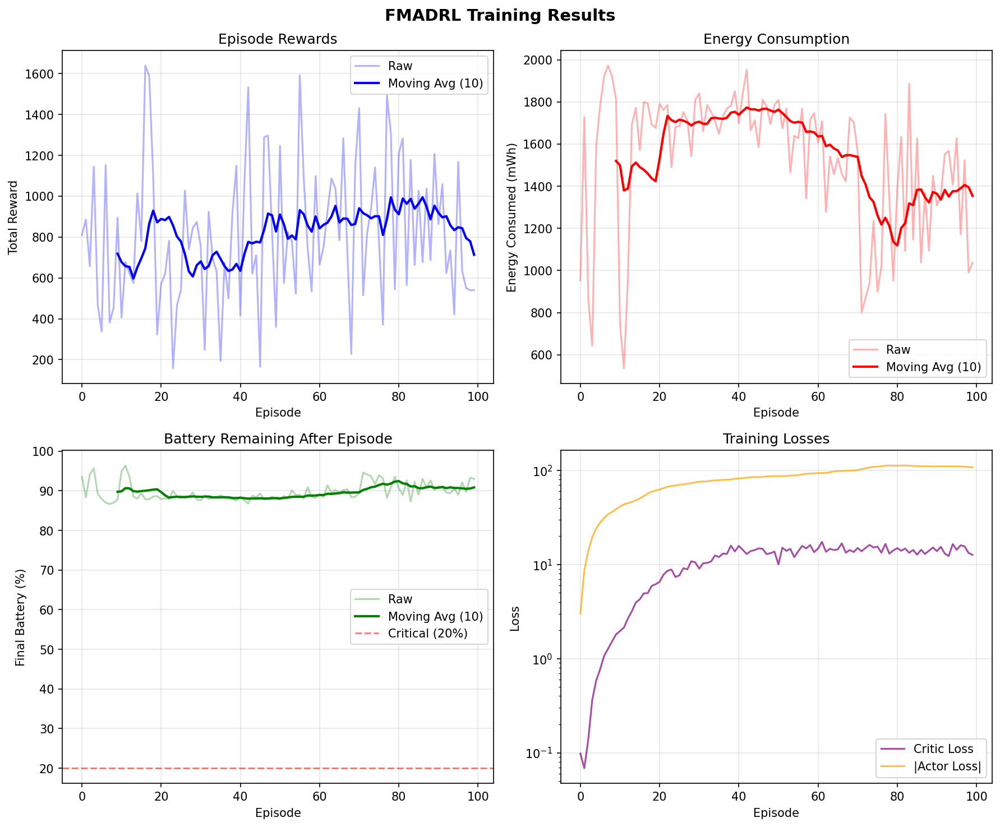
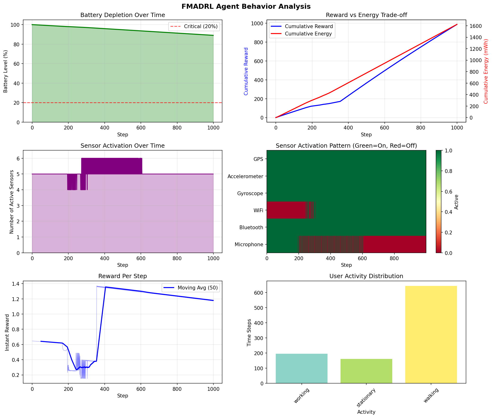
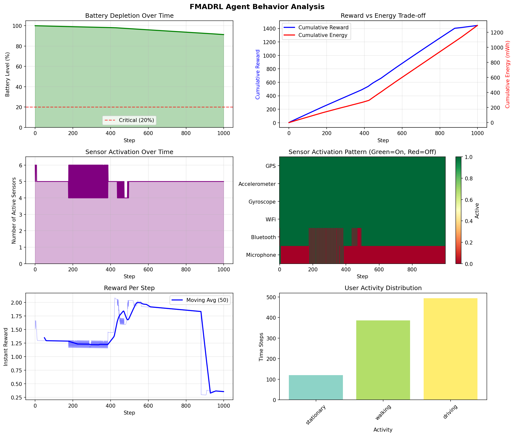

# FMADRL: Federated Multi-Agent Deep Reinforcement Learning for Mobile Energy Optimization

[](https://www.python.org/downloads/)
[](https://pytorch.org/)
[](https://opensource.org/licenses/MIT)

## Overview

This repository contains the implementation of the **Federated Multi-Agent Deep Reinforcement Learning (FMADRL)** framework for unified energy optimization in mobile sensing and edge computing, as described in our research paper.

The framework addresses critical limitations in existing mobile energy optimization approaches by:

1. **Unified Sensor-Computation-Communication Optimization**: Jointly optimizes sensor activation, computation offloading, and communication decisions
2. **Multi-Agent Deep RL**: Coordinates multiple sensors and computation resources simultaneously
3. **Federated Learning**: Enables privacy-preserving collaborative learning across distributed devices
4. **Battery-Aware Adaptation**: Dynamically adjusts policies based on battery state
5. **Cross-Device Personalization**: Transfers knowledge across device types and user profiles

## Results and Visualizations

### Training Results

The following visualization shows the training progress over 100 episodes, including episode rewards, energy consumption, battery remaining, and training losses:



The training results demonstrate:
- **Improving Episode Rewards**: Moving average reward increases from ~700 to ~900-1000, showing successful learning
- **Stable Battery Management**: Battery levels consistently remain above 85%, well above the critical 20% threshold
- **Converging Losses**: Both critic and actor losses stabilize, indicating successful convergence
- **Energy Optimization**: Energy consumption stabilizes around 1400-1500 mWh after initial exploration

### Model Evaluation

#### Early Training (Episode 10)

The checkpoint at episode 10 shows the model's behavior during early training:



#### Final Model (After Full Training)

The final trained model demonstrates optimized sensor coordination and energy management:



For detailed analysis of the training process and model behavior, see [FMADRL_Training_Analysis.md](FMADRL_Training_Analysis.md).

## Project Structure

```
CSE-535-F25-FMADRL-Model/
├── requirements.txt         # Python dependencies
├── README.md               # This file
└── src/
    ├── __init__.py         # Package initialization
    ├── environment.py      # Mobile device simulation environment
    ├── agents.py           # Multi-agent RL implementation
    ├── federated.py        # Federated learning components
    └── train.py            # Training scripts
```

## Installation

### Prerequisites

- Python 3.8 or higher
- pip package manager

### Setup

```bash
# Clone the repository
git clone https://github.com/sarrrthakkk/CSE-535-F25-FMADRL-Model.git
cd CSE-535-F25-FMADRL-Model

# Create virtual environment (recommended)
python -m venv venv
source venv/bin/activate  # On Windows: venv\Scripts\activate

# Install dependencies
pip install -r requirements.txt
```

## Quick Start

### Single Device Training (Baseline)

```bash
python src/train.py --n-devices 1 --episodes 100 --episode-length 1000
```

### Federated Training (Multiple Devices)

```bash
python src/train.py --n-devices 10 --fed-rounds 50 --client-fraction 0.5 --local-epochs 5
```

### With Differential Privacy

```bash
python src/train.py --n-devices 10 --fed-rounds 50 --dp --dp-epsilon 1.0
```

## Command Line Arguments

| Argument | Default | Description |
|----------|---------|-------------|
| `--n-devices` | 10 | Number of simulated devices |
| `--episodes` | 100 | Training episodes (single device) |
| `--episode-length` | 1000 | Steps per episode |
| `--batch-size` | 64 | Training batch size |
| `--fed-rounds` | 50 | Federated learning rounds |
| `--client-fraction` | 0.5 | Fraction of clients per round |
| `--local-epochs` | 5 | Local training epochs |
| `--dp` | False | Enable differential privacy |
| `--dp-epsilon` | 1.0 | Privacy budget epsilon |
| `--hidden-dim` | 128 | Hidden layer dimension |
| `--lr` | 1e-4 | Learning rate |
| `--gamma` | 0.99 | Discount factor |
| `--device` | cpu | Device (cpu/cuda) |
| `--output-dir` | outputs | Output directory |

## Components

### 1. Mobile Device Environment (`environment.py`)

Simulates a mobile device with:
- Multiple sensors (GPS, accelerometer, gyroscope, WiFi, Bluetooth, microphone)
- Battery management and energy tracking
- User activity patterns (walking, driving, stationary, etc.)
- Computation task queue
- Network conditions

Key classes:
- `MobileDeviceEnvironment`: Single device simulation
- `MultiDeviceEnvironment`: Multi-device wrapper for federated learning
- `SensorConfig`: Sensor configuration (power, sampling rate, utility)
- `UserActivityPattern`: User behavior simulation

### 2. Multi-Agent RL (`agents.py`)

Implements multi-agent deep reinforcement learning:
- `SensorAgentNetwork`: Neural network for each sensor (activation + rate control)
- `ComputeAgentNetwork`: Neural network for computation offloading decisions
- `MultiAgentController`: Coordinates all agents with centralized training
- `CentralizedCritic`: Shared critic for multi-agent coordination (CTDE)

### 3. Federated Learning (`federated.py`)

Privacy-preserving collaborative learning:
- `FederatedAggregator`: Server-side aggregation (FedAvg, weighted, median)
- `FederatedClient`: Client-side local training
- `TransferLearning`: Cross-device knowledge transfer

Features:
- Differential privacy support (gradient clipping + noise)
- Multiple aggregation methods
- Device-specific personalization

### 4. Training Script (`train.py`)

Main training loop supporting:
- Single device training (baseline)
- Federated training across multiple devices
- Policy evaluation and checkpointing
- Metrics logging

## Battery-Aware Reward Shaping

The reward function implements battery-level-dependent optimization:

```
R = ω(b) × U - (1 - ω(b)) × E
```

Where:
- `ω(b)` = battery-dependent weight (decreases as battery depletes)
- `U` = sensing/computation utility
- `E` = energy consumption

When battery is high → prioritize utility
When battery is low → prioritize energy saving

## Example Usage

### Programmatic API

```python
from src.environment import MobileDeviceEnvironment
from src.agents import MultiAgentController

# Create environment
env = MobileDeviceEnvironment(episode_length=1000)

# Create controller
controller = MultiAgentController(
    observation_dim=env.observation_dim,
    n_sensors=env.n_sensors,
    hidden_dim=128
)

# Training loop
obs = env.reset()
for step in range(1000):
    flat_obs = env.get_flat_observation()
    
    # Get actions from multi-agent controller
    sensor_actions = controller.get_sensor_actions(flat_obs)
    
    # Step environment
    next_obs, reward, done, info = env.step(sensor_actions)
    
    # Store and update
    controller.store_transition(flat_obs, sensor_actions, reward, 
                                env.get_flat_observation(), done)
    controller.update(batch_size=32)
    
    if done:
        break

print(f"Energy consumed: {env.total_energy_consumed:.2f} mWh")
print(f"Final battery: {env.battery_level:.1%}")
```

### Federated Training

```python
from src.federated import FederatedAggregator, FederatedClient
from src.agents import MultiAgentController

# Create aggregator
aggregator = FederatedAggregator(
    aggregation_method="fedavg",
    differential_privacy=True,
    dp_epsilon=1.0
)

# Initialize with a template model
template = MultiAgentController(obs_dim, n_sensors)
aggregator.initialize_global_model(template.get_model_parameters())

# Training rounds
for round in range(50):
    client_updates = []
    for client in clients:
        # Local training...
        client_updates.append(updated_params)
    
    # Aggregate
    global_params = aggregator.aggregate(client_updates)
```

## References

This work builds upon insights from:

1. **Sensors Power Hungry** - Empirical energy characterization of smartphone sensors
2. **EEMSS** - Hierarchical sensor management achieving 75% battery improvement
3. **RL Adaptive Sensing** - Reinforcement learning for sensor control
4. **Context-Aware ML** - Online supervised learning for cloud vs local execution
5. **Battery-Aware MEC** - Mathematical optimization for edge computing
6. **Pseudo-Monopulse Tracking** - Efficient antenna tracking algorithms
7. **SoftSense** - Low-power collaborative sensing (18× power reduction)

## Authors

- Sarthak Mishra (smish147@asu.edu)
- Dylan Forrest (dforres4@asu.edu)
- Ayushi Jignesh Desai (adesai67@asu.edu)
- Fahad Faleh A Albaqami (falbaqam@asu.edu)

School of Computing and Augmented Intelligence  
Arizona State University

